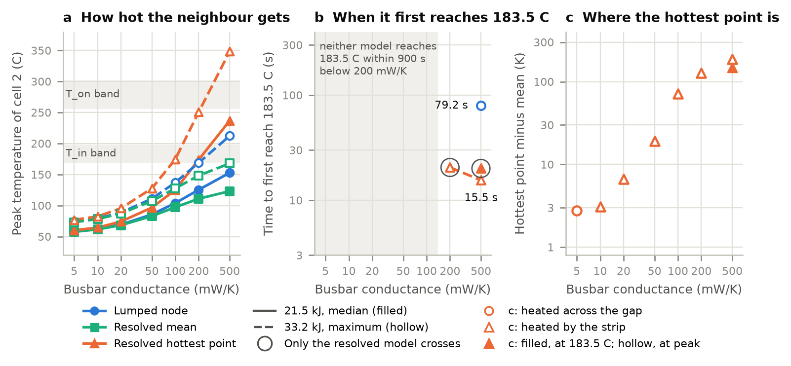

# Where and when a neighbour cell first reaches thermal-runaway onset temperatures: resolved against lumped, a pre-registered two-cell LG M50 pilot

Siddharth Satte, COEP Technological University, Pune, 7 October 2026. [github.com/siddharth161204-wq/m50-two-cell-pilot](https://github.com/siddharth161204-wq/m50-two-cell-pilot){.nobr}, predictions commit c57ccb8, public at 06:42 UTC, before any coupled resolved run.

1. With a copper busbar (500 mW/K) and the largest Databank cell-body energy (33.2 kJ), the resolved neighbour's hottest point first reaches 183.5 C, the mean T_in of Koenig, Zhao and Deng, 64 s before the lumped node: 5.7 s against 69.6 s with a 10 s release, 15.5 s against 79.2 s with a 30 s one. The hottest 1 % follows at 11.6 s and 25.0 s, but the resolved mean never reaches 183.5 C: the lumped node is a minute late for the hottest point and 44 K too hot for the mean.
2. The smallest busbar conductance at which only the resolved model reaches 183.5 C is 200 mW/K (100 mW/K for the band's lower edge, 169.0 C); in each of those cases at most 0.52 % of the cell, a third of a gram, gets above 183.5 C.

Figure 1. Registered runs with two strips and a 30 s release. (a) Peak temperatures against the two-sigma bands of T_in and T_on. (b) First time each model reaches 183.5 C. (c) Hottest point minus mean at the median energy, at its peak (hollow) and when it first reaches 183.5 C (filled); triangles are heated mainly by a strip, circles across the gap.

## Method

1. Cell 1 is a lumped LG 21700-M50 (bottom-vent variant) releasing its Battery Failure Databank cell-body energy, the minimum, median or maximum of 17 fully charged tests (8.75, 21.5 or 33.2 kJ), as a triangular pulse over 10 or 30 s.
2. Paths to cell 2: busbar strips of 5 to 500 mW/K (0.2 by 8 mm nickel over the 23.1 mm pitch is about 6 mW/K, a 30 mm^2^ copper plate about 500 mW/K), a 2 mm air gap (17 mW/K) and grey radiation (view factor 0.16); both cells lose heat to a 25 C room.
3. Cell 2 is solved as one temperature and as a 3D scikit-fem field (roll 1.3 W/mK across and 25 W/mK along the layers, 0.25 mm steel can, strips on an 8 mm cap disc and a rim annulus) with the same cell 1 history, heat capacity, paths and losses.
4. Levels from Koenig, Zhao and Deng (2025), whose simulated ARC test of a 720 g cell with NCM811 kinetics gives main-cluster means T_in = 183.5 C (exotherm trigger at 0.15 C/min) and T_on = 278.9 C (internal short), with two-sigma bands read from their Fig. 7 as 169.0 to 198.0 C and 255.7 to 302.1 C.
5. Checks: heated by radiation alone, the resolved mean stays within 0.98 % of the lumped rise; energy closes to 3 parts in 10^11^ in every run; at 33.2 kJ and 500 mW/K, halving the time step moves the hottest-point crossings by at most 0.01 s, and halving every mesh spacing by at most 0.08 s (30 s release).
6. Run after the predictions: the 42 cases with two strips, and 7 with one strip at the negative end, as in a series string, which moves the hottest point to the bottom rim (183.5 C at 25.0 s instead of 20.1 s; median energy, 500 mW/K). Exploratory: an isotropic 25 W/mK roll lowers the 33.2 kJ, 500 mW/K hot spot from 348 C to 248 C and delays 183.5 C from 15.5 s to 19.3 s.

## Limits

1. Conduction and radiation only: ejecta, flame and venting are excluded, so nothing here says whether a real module propagates. Coupling is one-way; in four cases rerun two-way, cell 1 runs hotter, the hottest-point times move by at most 0.3 s and the resolved mean peaks 6 to 14 K higher, at 182 C for 33.2 kJ, just short of 183.5 C.
2. One geometry, with the strips placed directly on the jelly-roll ends; the cap assembly, tabs and headspace are not resolved, which probably exaggerates the terminal hot spot, and the properties are constant.
3. The release is a Databank energy shaped as a triangle, not a measured heat-rate curve; T_in and T_on are whole-cell ARC metrics of a different cell, applied here to a point, to the hottest 1 % and to the mean.

## Prediction scorecard

| | Prediction | Result | Measured |
|--|-------------------------------------------------|------|---------------------------------------------|
| P1 | At 5 mW/K neither model reaches 169.0 C | Held | Peaks of 39 to 77 C |
| P2 | At 500 mW/K the resolved hottest point reaches 183.5 C more than 50 % earlier | Held | 92 % and 80 % (central estimate 93 % and 81 %) |
| P3 | Only-resolved 183.5 C crossings begin at 100 or 200 mW/K; at 500 mW/K and 33.2 kJ the hottest point reaches 255.7 C | Held | From 200 mW/K; 255.7 C at 7.1 s and 19.2 s |
| P4 | Hottest point gap-facing at 5 and 10 mW/K, at a terminal end from 100 mW/K | Failed | Switch between 5 and 10 mW/K, where the hottest point is only 3 K above the mean |
| P5 | At 500 mW/K the resolved mean rises at least 15 % less than the lumped node | Held | 22 to 24 % less (central estimate 35 to 55 %, too high); two-way: 14.7 to 16.1 % in three cases, one under 15 % |

## What it means for module-scale modelling

Whether a resolved neighbour reaches onset before or after a lumped one depends on how much of it must be hot: at 500 mW/K its hottest point and its hottest 1 % get there about a minute sooner, while its mean never gets there in the only cases where the lumped node does. Onset in a neighbour is therefore a local event that a whole-cell threshold cannot settle, so the next step is to run onset kinetics such as those of Koenig, Zhao and Deng on the resolved field, with the cap assembly and tabs included.
